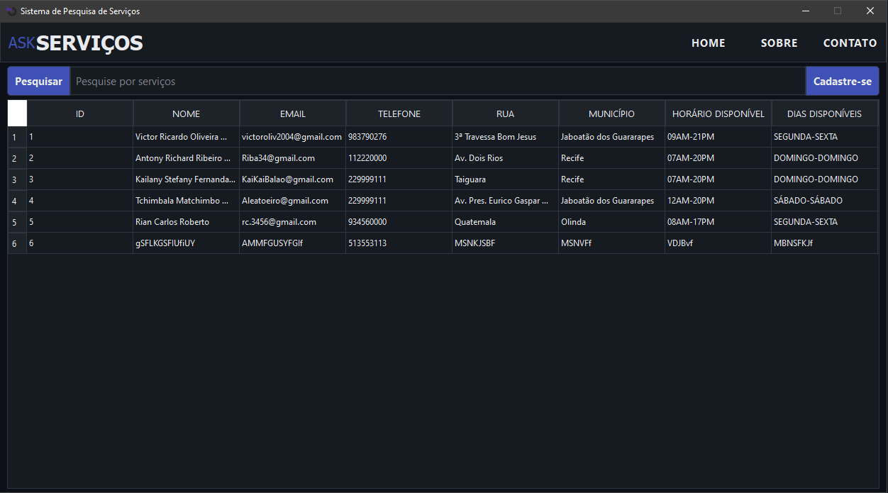
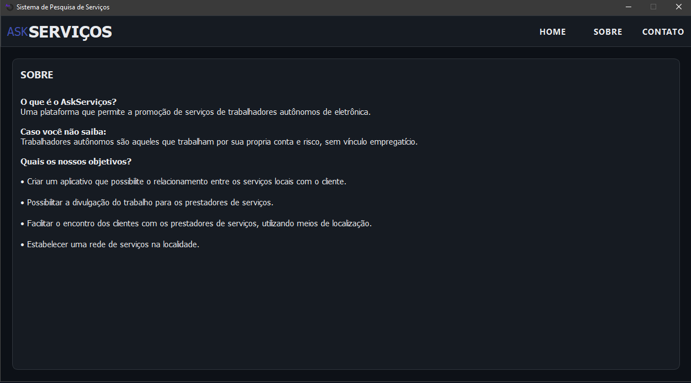
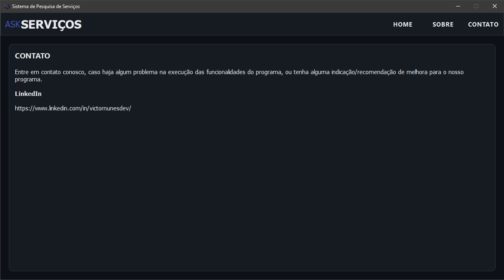
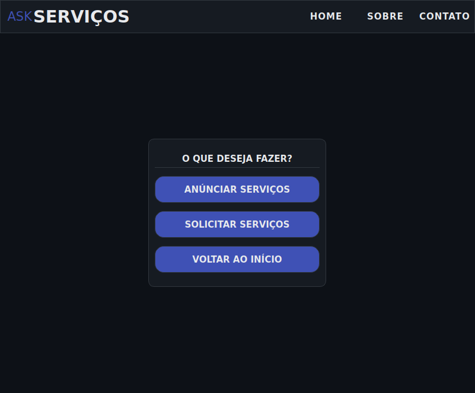
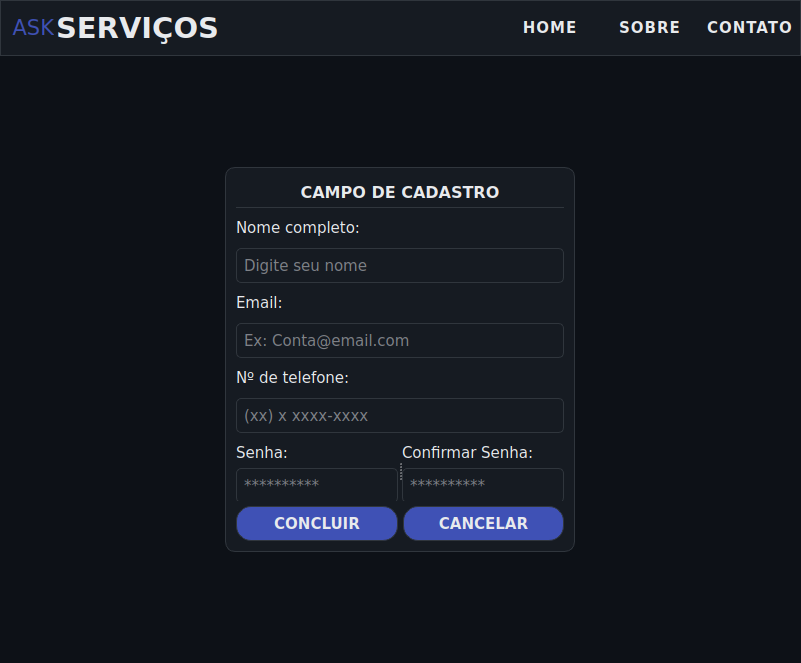
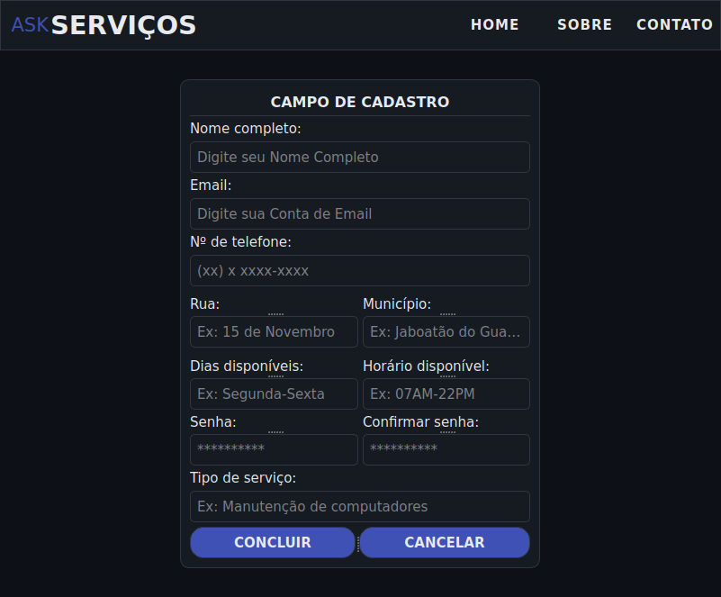

# Projeto AskServiços vers. Desktop

## Descrição

O AskServiços é um sistema de desktop com o propósito de conectar trabalhadores autônomos a clientes em potencial. A plataforma permite que os trabalhadores anunciem seus serviços, enquanto os clientes podem pesquisar e encontrar os profissionais de que precisam. O sistema armazena as informações dos usuários, separando-os em duas categorias: clientes e trabalhadores, para facilitar a busca.

## Tecnologias Utilizadas

O projeto foi construído com as seguintes tecnologias:

-   **Python:** A linguagem de programação principal usada para a lógica do aplicativo.
-   **PySide6:** Um conjunto de bindings Python para a estrutura de aplicativos Qt, usado para construir a interface do usuário.
-   **Qt Designer:** Uma ferramenta para projetar e construir interfaces gráficas do usuário (GUIs) a partir de componentes Qt.

## Screenshots da Aplicação

### Página Inicial (Homepage)

### Página Sobre (About)

### Página de Contato (Contact)

### Página de Seleção (Select)

### Página do Cliente (Client)

### Página do Trabalhador (Worker)

